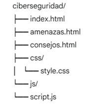

# Proyecto de Ciberseguridad: Protege tu Mundo Digital

Este repositorio contiene el código fuente de un **sitio web informativo sobre ciberseguridad**, diseñado para educar a los usuarios sobre conceptos clave, amenazas comunes y mejores prácticas para proteger su información en línea.

---

## 🚀 Objetivo del Proyecto

El principal objetivo de este proyecto es crear un **sitio web responsivo e interactivo** que sirva como una fuente de información accesible y útil sobre ciberseguridad. Se han aplicado conocimientos de **HTML5**, **CSS3**, **JavaScript**, **Bootstrap** y **jQuery** para ofrecer una experiencia de usuario moderna y dinámica.

---

## 📂 Estructura del Proyecto

El sitio web está organizado en una estructura de tres páginas, cada una dedicada a un aspecto específico de la ciberseguridad:

* **`index.html`**: La página de inicio, que ofrece una introducción general a la ciberseguridad y una navegación clara hacia las demás secciones.
* **`amenazas.html`**: Dedicada a explorar las amenazas cibernéticas más comunes, como *phishing*, *ransomware*, *malware* y ataques DDoS. Incluye secciones interactivas y un carrusel de ejemplos reales.
* **`consejos.html`**: Presenta una lista de buenas prácticas y consejos para protegerse en línea. Cuenta con un formulario de contacto con validación y un modal interactivo para un "test de seguridad".
* **`css/style.css`**: Contiene los estilos personalizados que complementan y ajustan el framework Bootstrap, asegurando un diseño atractivo y responsivo.
* **`js/script.js`**: Implementa la lógica interactiva del sitio, utilizando jQuery para efectos visuales, manipulación del DOM y validaciones de formularios.

---

## ✨ Características Principales

* **Diseño Responsivo**: Adaptado para verse bien en cualquier dispositivo, desde ordenadores de escritorio hasta teléfonos móviles, gracias al uso de **Bootstrap 5** y **media queries** en CSS.
* **Navegación Intuitiva**: Una barra de navegación clara y fácil de usar permite a los usuarios moverse entre las diferentes secciones del sitio.
* **Contenido Interactivo**:
    * En la sección de "Amenazas Comunes", se utilizan **tarjetas colapsables (jQuery)** para mostrar y ocultar información detallada sobre cada tipo de ataque, y un **carrusel (Bootstrap)** para presentar casos reales.
    * En "Consejos de Seguridad", se emplea un **acordeón (Bootstrap)** para organizar las buenas prácticas y un **modal (Bootstrap + jQuery)** para un test de seguridad interactivo.
* **Validación de Formulario**: El formulario de contacto en la página de "Consejos de Seguridad" incluye **validación en tiempo real con JavaScript y jQuery**, mejorando la experiencia del usuario.
* **Uso de jQuery**: Implementación de efectos interactivos como `slideToggle()` para ocultar/mostrar contenido y manejo de eventos para la validación del formulario y el test de seguridad.
* **HTML Semántico**: Utilización de etiquetas HTML5 semánticas para una estructura de contenido clara y accesible.

---

## 🛠️ Tecnologías Utilizadas

* **HTML5**: Estructura del contenido.
* **CSS3**: Estilos y diseño.
* **JavaScript**: Lógica interactiva y manipulación del DOM.
* **Bootstrap 5.3.7**: Framework CSS para un diseño responsivo y componentes pre-diseñados.
    * CSS: `https://cdn.jsdelivr.net/npm/bootstrap@5.3.7/dist/css/bootstrap.min.css`
    * JS: `https://cdn.jsdelivr.net/npm/bootstrap@5.3.7/dist/js/bootstrap.bundle.min.js`
* **jQuery 3.7.1**: Biblioteca JavaScript para simplificar la manipulación del DOM y la gestión de eventos.
    * JS: `https://code.jquery.com/jquery-3.7.1.js`

---

## 🚀 Cómo Ejecutar el Proyecto

1.  **Clona el Repositorio:**
    ```bash
    git clone [https://github.com/tu-usuario/ciberseguridad.git](https://github.com/tu-usuario/ciberseguridad.git)
    ```
2.  **Navega al Directorio del Proyecto:**
    ```bash
    cd ciberseguridad
    ```
3.  **Abre los Archivos:** Simplemente abre `index.html` en tu navegador web preferido (haciendo doble clic o arrastrándolo a la ventana del navegador).

---

## 🤝 Contribuciones

¡Las contribuciones son bienvenidas! Si deseas mejorar este proyecto, siéntete libre de:

1.  Hacer un "fork" de este repositorio.
2.  Crear una nueva rama (`git checkout -b feature/nueva-caracteristica`).
3.  Realizar tus cambios y hacer commits (`git commit -m 'feat: añadir nueva característica'`).
4.  Subir tus cambios a tu repositorio (`git push origin feature/nueva-caracteristica`).
5.  Abrir un "Pull Request".

---

## 📄 Licencia

Este proyecto se distribuye bajo la licencia MIT. Consulta el archivo `LICENSE` para más detalles.

---

## ✉️ Contacto

Si tienes alguna pregunta o sugerencia, no dudes en contactarme a través de [tu-email@ejemplo.com](mailto:tu-email@ejemplo.com) o abriendo una *issue* en este repositorio.

---

